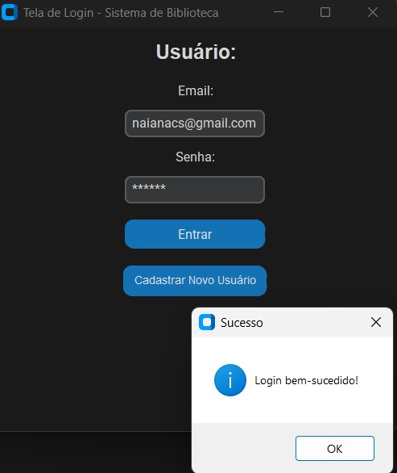
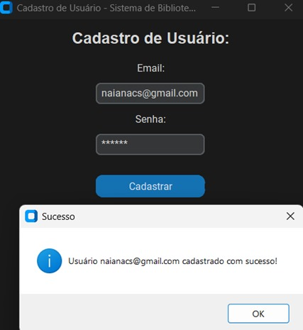
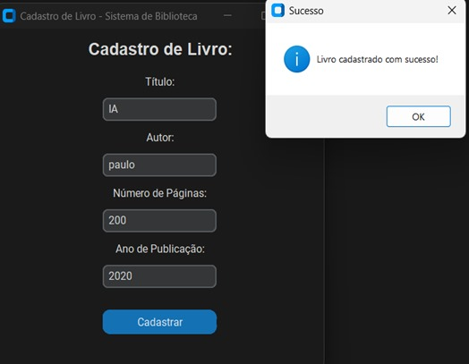
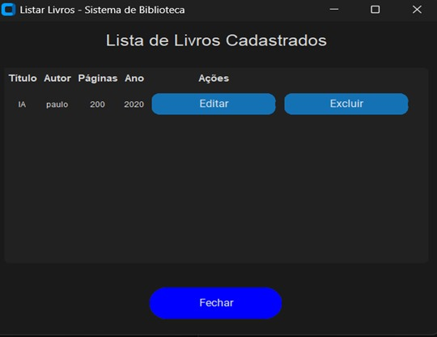

# Cadastro de Livros

Este projeto funciona como uma biblioteca virtual. Nele, é possível cadastrar os seguintes dados sobre os livros:

- **Título do livro**
- **Autor principal**
- **Quantidade de páginas**
- **Ano de publicação**

## Configuração do Firebase

1. Criado um projeto no Firebase
2. Habilitado o Firestore e a autenticação
3. Baixado o arquivo de configuração e colocado na pasta do projeto

## Instalações Necessárias

Para rodar este projeto, instale as seguintes bibliotecas:

```sh
pip install firebase-admin customtkinter
```

- `firebase-admin`: Permite que o sistema se conecte ao Firestore.
- `customtkinter`: Melhora a aparência das interfaces gráficas.

## Funcionalidades

### Cadastro e Login

Na tela inicial do sistema, o usuário encontra duas opções principais:

**Entrar** – Para quem já tem uma conta no sistema e deseja acessar seus recursos.
**Cadastrar** – Para quem ainda não possui uma conta e precisa criar uma nova.

Após clicar na opção **"Cadastrar"**, o usuário será direcionado para uma tela de **Cadastro de usuário **, onde ele poderá:

- **Criar uma nova conta**: O usuário precisa preencher informações como:
  - E-mail válido
  - Definir uma senha
  
### 1. Cadastrar Livro

O usuário deve fornecer todas as informações necessárias sobre a obra. Após finalizar o cadastro, o livro será adicionado ao sistema.

### 2. Listar Livros

Essa funcionalidade permite visualizar os livros cadastrados e acessar suas respectivas opções:

- **Excluir Livro**: O usuário pode remover um livro clicando na opção **"Excluir"**. O sistema exibirá uma mensagem confirmando que o livro foi removido com sucesso.
- **Editar Livro**: O usuário pode modificar as informações de um livro clicando na opção **"Editar"**. O sistema exibirá uma mensagem informando que os dados foram atualizados com sucesso.

---

##  Estrutura do Projeto

```bash
/cadastro de livros
│── imagem/              # Diretório para armazenar imagens
│── .gitignore           # Arquivo que define quais arquivos devem ser ignorados pelo Git
│── README.md            # Documentação do projeto
│── cadastro_livros.py   # Script para cadastro de livros
│── cadastro_usuario.py  # Script para cadastro de usuários
│── firebase_config.py   # Configuração do Firebase
│── listar_livros.py     # Script para listar livros
│── login.py             # Script para login de usuários
│── main.py              # Arquivo principal do projeto
│── principal.py         # Tela principal da aplicação

```
## Telas do Sistema
 
 
 
 
 
 


  

 
